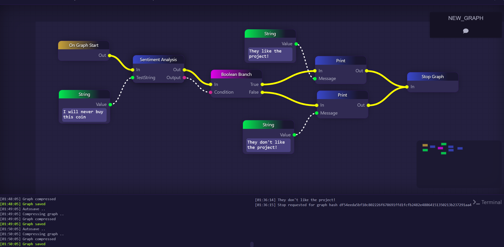

<!--
*** This README used the Best-README-Template (https://github.com/othneildrew/Best-README-Template).
-->

<!-- PROJECT SHIELDS -->

[![Contributors][contributors-shield]][contributors-url]
[![Forks][forks-shield]][forks-url]
[![Stargazers][stars-shield]][stars-url]
[![Issues][issues-shield]][issues-url]

<!-- PROJECT LOGO -->
 

  

  <h3 align="center">GraphLinq.MachineLearning</h3>

  

    Plugin for the GraphLinq Engine that uses Machine Learning to process a string of data.
     
    <a target="_blank" href="https://docs.graphlinq.io"><strong>Explore the docs »</strong></a>
     
     
    <a href="https://github.com/GraphLinq/GraphLinq.MachineLearning/issues">Report Bug</a>
    ·
    <a href="https://github.com/GraphLinq/GraphLinq.MachineLearning/issues">Request Feature</a>
  

<!-- TABLE OF CONTENTS -->

  
Table of Contents

  <ol>
    <li><a href="#about-the-project">About The Project</a></li>
    <li><a href="#getting-started">Getting Started</a></li>
    <li><a href="#contributing">Contributing</a></li>
    <li><a href="#contact">Contact</a></li>
  </ol>

<!-- ABOUT THE PROJECT -->
## About The Project

This plugin will allow a Graph to consume data, create a dataset, train a model, and make predictions using ML.NET.

(<a href="#readme-top">back to top</a>)

<!-- GETTING STARTED -->
## Getting Started

- Add the sample block to a graph
- Add a string to the input of the comments you want to try and predict
- Output string will return a Boolean of True or False. True is a positive sentiment, false is a negative sentiment.

### Examples

> Positive Sentiment

> Negative Sentiment

(<a href="#readme-top">back to top</a>)

<!-- CONTRIBUTING -->
## Contributing

If you have a suggestion that would make this repository better, please fork the repo and create a pull request. You can also simply open an issue. Don't forget to give the project a star! Thanks again!

1. Fork the Project
2. Create your Feature Branch (`git checkout -b feature/AmazingFeature`)
3. Commit your Changes (`git commit -m 'Add some AmazingFeature'`)
4. Push to the Branch (`git push origin feature/AmazingFeature`)
5. Open a Pull Request

(<a href="#readme-top">back to top</a>)

<!-- CONTACT -->
## Contact

GraphLinq Protocol - [@graphlinq_proto](https://twitter.com/graphlinq_proto)

Project Home: [https://graphlinq.io](https://graphlinq.io)

(<a href="#readme-top">back to top</a>)

Made with [contributors-img](https://contrib.rocks).

(<a href="#readme-top">back to top</a>)

<!-- MARKDOWN LINKS & IMAGES -->
<!-- https://www.markdownguide.org/basic-syntax/#reference-style-links -->

<!-- GitHub -->
[contributors-shield]: https://img.shields.io/github/contributors/GraphLinq/GraphLinq.MachineLearning.svg?style=for-the-badge
[contributors-url]: https://github.com/GraphLinq/GraphLinq.MachineLearning/graphs/contributors
[forks-shield]: https://img.shields.io/github/forks/GraphLinq/GraphLinq.MachineLearning.svg?style=for-the-badge
[forks-url]: https://github.com/GraphLinq/GraphLinq.MachineLearning/network/members
[stars-shield]: https://img.shields.io/github/stars/GraphLinq/GraphLinq.MachineLearning.svg?style=for-the-badge
[stars-url]: https://github.com/GraphLinq/GraphLinq.MachineLearning/stargazers
[issues-shield]: https://img.shields.io/github/issues/GraphLinq/GraphLinq.MachineLearning.svg?style=for-the-badge
[issues-url]: https://github.com/GraphLinq/GraphLinq.MachineLearning/issues
[license-shield]: https://img.shields.io/github/license/GraphLinq/GraphLinq.MachineLearning.svg?style=for-the-badge
[license-url]: https://github.com/GraphLinq/GraphLinq.MachineLearning/blob/master/LICENSE.txt
